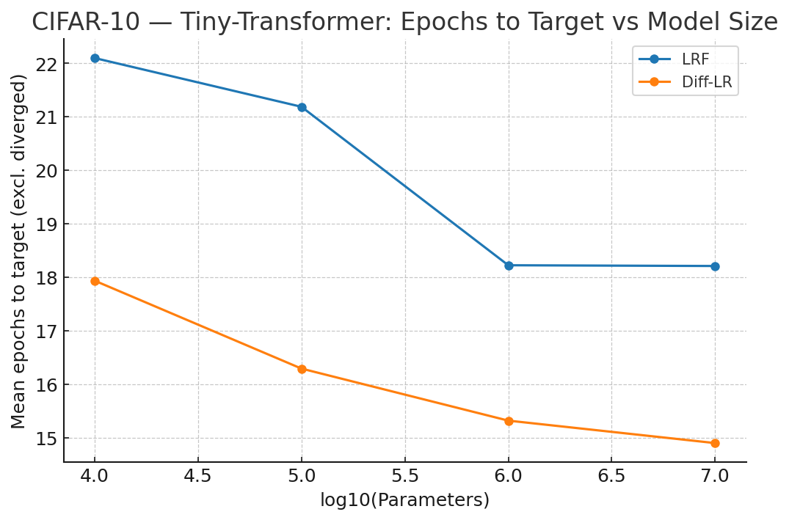
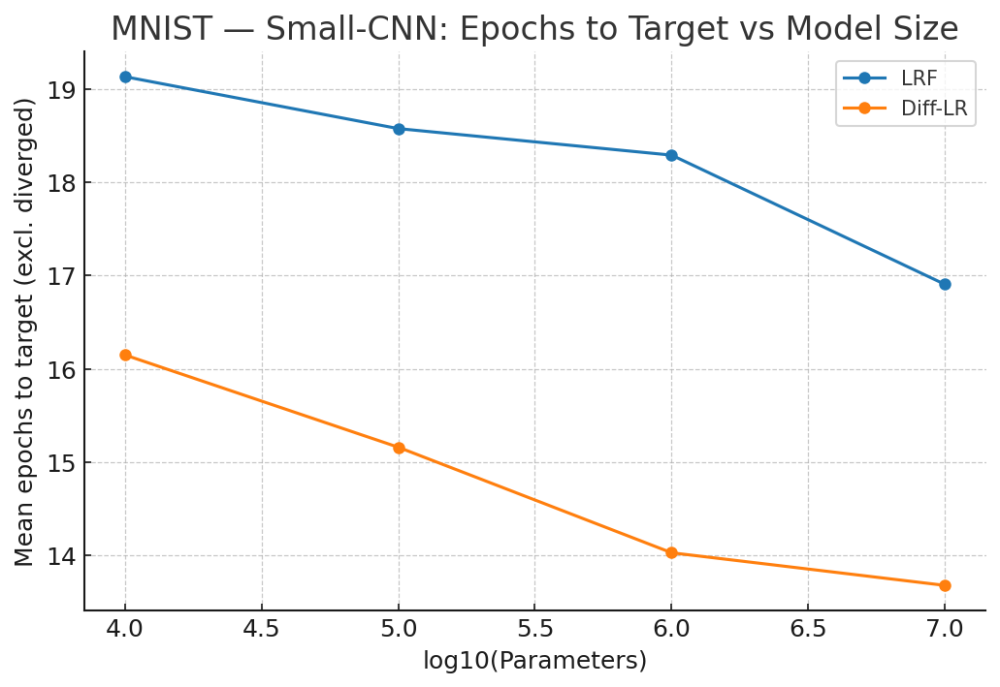

# Dynamic-LR: An Intelligent Method for Dynamic Learning Rate Optimization

This repository provides a method for dynamic learning rate optimization. It contains a Python implementation of an intelligent search algorithm that efficiently discovers an optimal initial learning rate, setting a strong foundation for stable and effective model training.

-----

## 📜 Files in this Repository

Here is a breakdown of the key files in this repository:

- **`DLR.py`**: A minimal, self-contained PyTorch implementation of the two-phase "Dynamic Learning Rate" (DLR) algorithm. This is the core of the project.
- **`Simulation of Diff-LR vs Learning Rate Finder.py`**: A Python script that runs a simulation to compare the performance of DLR against a traditional Learning Rate Finder (LRF).
- **`The_Discovery.md`**: A detailed narrative that explains the journey and thought process behind the creation of the DLR algorithm.
- **`diff_lr_sim_plots/`**: A directory containing plots generated by the simulation script, visualizing the performance comparison.
- **`diff_lr_sim_results.csv`**: A CSV file containing the raw results from the simulation, suitable for further analysis.
- **`LICENSE`**: The Apache 2.0 license under which this project is released.
- **`README.md`**: The file you are currently reading.

-----

## 💡 The Core Idea

The core challenge in training deep models is setting a proper learning rate. This method automates the discovery of an optimal starting rate, which is the crucial first step in any dynamic learning rate strategy (e.g., when using schedulers like `ReduceLROnPlateau`).

The algorithm performs a series of short, independent test runs to determine if the model is:

- 💥 **Overshooting**: The learning rate is too high, causing the training loss to explode or diverge.
- 📉 **Viable**: The learning rate leads to stable training and is considered a potential candidate.

By intelligently narrowing the search space, the algorithm quickly converges on a robust initial learning rate.

-----

## 🔬 How It Works: A Two-Phase Approach

The "Dynamic Learning Rate" (DLR) algorithm is implemented in two main phases, as detailed in `DLR.py` and inspired by the concepts in `The_Discovery.md`.

### Phase 1: Binary Search for Initial Learning Rate

This phase uses a binary search to find a good starting learning rate. It's designed to be a more robust and efficient alternative to a linear search (like the one used in traditional learning rate finders).

1.  **Set Bounds**: Start with a low learning rate (e.g., `1e-6`) and a high one (e.g., `1e-1`). These represent the search space for the optimal learning rate.
2.  **Test Midpoint**: The algorithm trains the model for a small number of epochs (e.g., 3) with the learning rate set to the geometric midpoint of the current `low` and `high` bounds.
3.  **Adjust Bounds**:
    - If the model **overshoots** (detected by a validation loss that is significantly higher than the training loss), the midpoint becomes the new `high`. This indicates that the learning rate is too high.
    - Otherwise, the midpoint becomes the new `low`, and this learning rate is stored as the best candidate so far.
4.  **Repeat**: This process is repeated for a fixed number of iterations or until the `high` and `low` bounds are very close to each other. The best candidate found is then used as the initial learning rate for full training.

### Phase 2: Dynamic Adjustments During Full Training

With a good initial rate, the second phase monitors the training process and dynamically adjusts the learning rate based on simple but effective heuristics.

- **Overshoot Detection**: If the validation loss increases while the training loss is still decreasing, it's a sign of overshooting. The learning rate is then reduced significantly (e.g., by a factor of 0.3).
- **Undershoot Detection**: If both the training and validation losses get "stuck" at a high value, it suggests that the learning rate is too low. In this case, the learning rate is increased (e.g., by a factor of 1.3) to escape the plateau.
- **Integration with Schedulers**: This dynamic adjustment is designed to work in conjunction with standard learning rate schedulers like `ReduceLROnPlateau`, providing an extra layer of intelligent control.

-----

## 🚀 How to Use `DLR.py`

The `DLR.py` script is designed to be run directly. It will:
1. Automatically download the CIFAR-10 dataset.
2. Run Phase 1 to find an optimal initial learning rate.
3. Run Phase 2 to train a tiny CNN on CIFAR-10 with the dynamic learning rate adjustments.

To run it, simply execute the following command:
```bash
python DLR.py
```

-----

## 📊 Simulation: Diff-LR vs. Learning Rate Finder (LRF)

A simulation was conducted to compare the performance of **Diff-LR** against a traditional **Learning Rate Finder (LRF)**. The simulation generated synthetic "epochs-to-target" numbers across various datasets, model architectures, and model sizes.

### Simulation Setup

The simulation, detailed in `Simulation of Diff-LR vs Learning Rate Finder.py`, is based on a parametric growth model and a set of algorithmic assumptions. Here are the key components:

- **Datasets**: The simulation uses three datasets with varying levels of difficulty: MNIST, CIFAR-10, and a subset of ImageNet.
- **Model Families**: Four major model families are represented: MLPs, Small-CNNs, ResNet-ish models, and Tiny-Transformers.
- **Model Sizes**: The models are tested across four parameter buckets: Small (~10k), Medium (~100k), Large (~1M), and XL (~10M).
- **Assumptions**: The simulation makes explicit assumptions about the success probability, quality of the found learning rate, and divergence probability for both the DLR and LRF methods. These assumptions are documented within the simulation script.

### Key Findings from the Simulation

The results consistently show that **Diff-LR requires fewer epochs to reach the target accuracy** compared to LRF across all tested configurations. This indicates that Diff-LR is a more efficient and reliable method for finding an optimal learning rate.

Below are some of the plots from the simulation that illustrate these findings:

- **CIFAR-10 — Tiny-Transformer**:
  

- **ImageNet-subset — Small-CNN**:
  

- **MNIST — Small-CNN**:
  

The full simulation results can be found in `diff_lr_sim_results.csv`.

-----

## ✨ The Journey Behind the Idea

The concept for this dynamic learning rate finder was inspired by the desire to automate and improve upon traditional methods. For a detailed narrative of how this idea was developed, from understanding overfitting and underfitting to the "aha!" moment of applying binary search, check out [The_Discovery.md](./The_Discovery.md).

-----

## 📜 License

This repository is licensed under the Apache License, Version 2.0. See the [LICENSE](./LICENSE) file for details.
